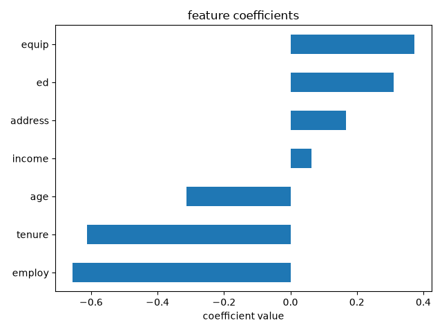

# Customer Churn Prediction Using Logistic Regression

A Machine Learning project that predicts whether a telecommunications customer is likely to leave a service using Logistic Regression. This project focuses on data preprocessing, feature standardization, model training, prediction, evaluation and visualization using Python and Scikit-learn.

**Author:** Bharath Reddy  
**Domain:** Machine Learning  
**Algorithm:** Logistic Regression  
**Language:** Python  
**Project Type:** Machine Learning / Binary Classification

---

## Project Overview

Customer churn occurs when a customer stops using a company's products or services. Predicting customer churn helps businesses understand customer behavior and identify customers who may leave.

This project uses Logistic Regression, a supervised Machine Learning algorithm, to predict whether a telecommunications customer will churn based on seven selected customer attributes.

### Project Objectives

- Predict whether a customer is likely to churn.
- Understand and preprocess customer data.
- Apply feature standardization.
- Train a Logistic Regression model.
- Evaluate model performance using log loss.
- Visualize and interpret feature coefficients.

### Project Details

- **Target Variable:** `churn`
- **Classification Type:** Binary Classification
- **Model:** Logistic Regression
- **Evaluation Metric:** Log Loss
- **Visualization:** Feature Coefficient Bar Chart

---

## Technologies Used

- **Python:** Main programming language.
- **Pandas:** Data loading and manipulation.
- **NumPy:** Numerical computations.
- **Scikit-learn:** Data preprocessing, model training and evaluation.
- **Matplotlib:** Data visualization.
- **VS Code:** Development environment.
- **Git and GitHub:** Version control and project hosting.

---

## Dataset

This project uses IBM's sample telecommunications customer churn dataset, named `ChurnData.csv`.

**Dataset Source:** IBM Developer Skills Network

**[Download ChurnData.csv](https://cf-courses-data.s3.us.cloud-object-storage.appdomain.cloud/IBMDeveloperSkillsNetwork-ML0101EN-SkillsNetwork/labs/Module%203/data/ChurnData.csv)**

### Dataset Information

- **Total Records:** 200
- **Total Columns:** 28
- **Target Variable:** `churn`
- **Non-Churn Customers:** 142 (71%)
- **Churn Customers:** 58 (29%)

### Input Features

The model uses the following seven selected features:

| Feature | Description |
|---|---|
| `tenure` | Length of the customer relationship |
| `age` | Customer age |
| `address` | Time at current address |
| `income` | Customer income |
| `ed` | Education level |
| `employ` | Employment duration |
| `equip` | Equipment ownership indicator |

These features are selected to follow the IBM learning exercise rather than using all available input columns.

---

## Machine Learning Algorithm

### Logistic Regression

Logistic Regression is a supervised Machine Learning algorithm used for classification problems. Despite its name, it is commonly used to predict categorical outcomes.

In this project, Logistic Regression predicts whether a customer will churn or not.

The sigmoid function converts a linear combination of input features into a probability between 0 and 1.

**Formula:**

\[
P(\text{churn}=1 \mid X)=\frac{1}{1+e^{-(w^TX+b)}}
\]

Where:

- `P` = Probability of customer churn
- `X` = Input features
- `w` = Model coefficients
- `b` = Intercept
- `e` = Euler's number

### Prediction

- If the predicted probability is 0.5 or higher, the customer is classified as churn (`1`).
- If the predicted probability is below 0.5, the customer is classified as no churn (`0`).

---

## Project Workflow

The project follows these steps:

- **Data Loading:** Load the customer churn dataset using Pandas.
- **Feature Selection:** Select seven relevant input features and the target variable.
- **Data Preprocessing:** Prepare the selected features for Machine Learning.
- **Feature Standardization:** Apply `StandardScaler` to standardize the input features.
- **Train-Test Split:** Split the dataset into training and testing sets using an 80:20 ratio.
- **Model Training:** Train the Logistic Regression classifier using Scikit-learn.
- **Prediction:** Predict customer churn labels and probabilities.
- **Model Evaluation:** Calculate log loss using the actual labels and predicted probabilities.
- **Visualization:** Generate a bar chart of the learned feature coefficients.

### Train-Test Split

- **Training Data:** 160 records (80%)
- **Testing Data:** 40 records (20%)
- **Random State:** 4

---

## Model Evaluation

### Log Loss

Log Loss is an evaluation metric that measures how well a classification model predicts probabilities.

It penalizes incorrect predictions, especially when the model is highly confident in those predictions.

**Formula:**

\[
L=-[y\log(p)+(1-y)\log(1-p)]
\]

Where:

- `y` = Actual label
- `p` = Predicted probability
- `L` = Log loss

### Interpretation

- Lower log loss indicates better probabilistic predictions.
- Higher log loss indicates poorer probabilistic predictions.

---

## Results

The existing implementation reports the following results:

| Metric | Result |
|---|---:|
| Total Records | 200 |
| Training Samples | 160 |
| Testing Samples | 40 |
| Input Features | 7 |
| Algorithm | Logistic Regression |
| Test Log Loss |0.40689 |

The model generates predicted class labels and churn probabilities for the test dataset.

The reported log loss is from the existing implementation and should be verified by running the project.

**Note:** Log loss alone does not establish model accuracy, precision, recall or performance on new customer populations.

---

## Feature Coefficient Visualization

The project visualizes the learned Logistic Regression coefficients using Matplotlib.



### Feature Interpretation

In the reported run:

**Negative Coefficients:**
- `employ`
- `tenure`
- `age`

**Positive Coefficients:**
- `income`
- `address`
- `ed`
- `equip`

Because the features are standardized, the coefficients indicate the direction of association with the model's log-odds of churn, holding the other features constant.

These coefficients describe associations learned by the model and do not establish causal relationships.

---

## Project Structure

```text
customer-churn-prediction/
│
├── outputs/
│   └── feature_coefficients.png
│
├── src/
│   ├── __init__.py
│   ├── config.py
│   ├── data_loader.py
│   ├── evaluator.py
│   ├── preprocessing.py
│   ├── trainer.py
│   └── visualizer.py
│
├── main.py
├── README.md
└── requirements.txt
```

### File Descriptions

- **main.py:** Main entry point that runs the complete project workflow.
- **config.py:** Stores configuration details, dataset path and selected features.
- **data_loader.py:** Loads the customer churn dataset.
- **preprocessing.py:** Performs feature standardization and train-test splitting.
- **trainer.py:** Trains the Logistic Regression model.
- **evaluator.py:** Generates predictions and calculates log loss.
- **visualizer.py:** Creates and saves the feature coefficient chart.
- **outputs/:** Stores generated visualizations.
- **requirements.txt:** Contains the required Python libraries.
- **README.md:** Provides project documentation.

---

## Installation and Setup

### Prerequisites

- Python 3.10 or later
- pip
- VS Code

### Clone the Repository

```bash
git clone https://github.com/bharathreddy37040/customer-churn-prediction.git
```

```bash
cd customer-churn-prediction
```

Replace `YOUR_USERNAME` with your GitHub username.

### Create a Virtual Environment

```bash
python -m venv venv
```

### Activate the Virtual Environment

For Windows PowerShell:

```powershell
.\venv\Scripts\Activate.ps1
```

### Install Dependencies

```bash
pip install -r requirements.txt
```

### Download the Dataset

Download `ChurnData.csv` from the IBM dataset link provided above.

Place it at the location specified by `DATASET_PATH` in `src/config.py`.

Update the path in `config.py` if necessary.

### Run the Project

```bash
python main.py
```

The program runs the machine learning workflow, generates predictions, calculates log loss and creates the feature coefficient visualization.

---

## Key Learnings

Through this project, I studied:

- Fundamentals of Machine Learning.
- Logistic Regression for binary classification.
- Data loading and manipulation using Pandas.
- Numerical operations using NumPy.
- Feature standardization using Scikit-learn.
- Train-test splitting and model training.
- Class prediction and probability prediction.
- Model evaluation using log loss.
- Feature coefficient interpretation.
- Data visualization using Matplotlib.
- Modular Python project organization.

---

## Limitations

- **Small Dataset:** The dataset contains only 200 records, including 40 test samples.
- **Class Imbalance:** The dataset contains 71% non-churn customers and 29% churn customers.
- **Preprocessing Leakage:** In the existing implementation, the scaler is fitted before the train-test split. A more robust approach is to split the data first and fit the scaler only on the training data.
- **Limited Evaluation:** The existing implementation reports log loss but does not provide accuracy, precision, recall or F1-score.
- **Generalization:** Performance on this small dataset may not represent results on new or real-world customer populations.

---

## Future Improvements

- Apply a leakage-free preprocessing pipeline.
- Evaluate the model using accuracy, precision, recall and F1-score.
- Generate a confusion matrix.
- Perform cross-validation.
- Compare Logistic Regression with other classification algorithms.
- Improve model performance through hyperparameter tuning.
- Develop a simple web application to demonstrate customer churn predictions.

---

## Acknowledgment

This project is based on the customer churn Logistic Regression exercise from **IBM Developer Skills Network** and builds upon the existing implementation by [Bharath Reddy].

I used the learning materials and existing implementation to study the Machine Learning workflow and customize the project as part of my learning journey in Python and Machine Learning.

---

## Author

**Bharath Reddy**

Aspiring Python and Machine Learning Developer

**GitHub:** https://github.com/bharathreddy37040

**Project:** Customer Churn Prediction Using Logistic Regression
